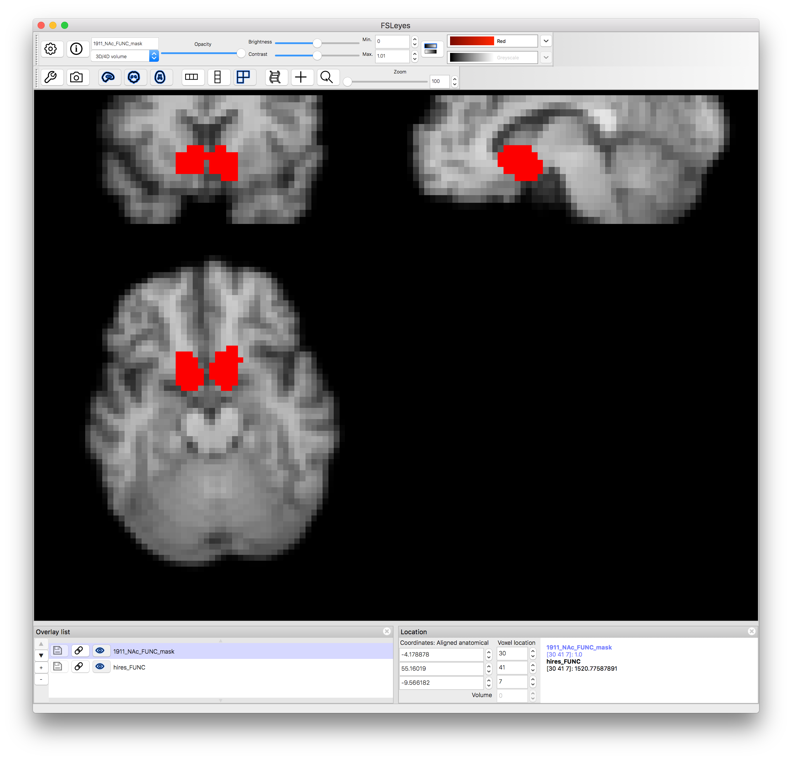

# Creating Masks

**Pyneal** requires that you input a mask for use during real-time analysis. This mask must have the same voxel dimensions and image orientation as the incoming functional data.

Depending on your real-time analysis needs, one option could be to create a functional ROI by collecting a localizer task run and quickly analyzing it during your scanning session. 

Alternatively, you may wish to focus your analysis on predefined anatomical ROIs. In this case, you need to transform an anatomical mask from a standard space (like MNI) to match the functional data of your participant in the scanner.  

The `createMask.py` tool will assist you in quickly creating whole-brain or anatomical masks during a real-time session. 

**createMask** provides you with two mask creation options:

* **Whole Brain Mask**: This option will create a whole brain mask from the functional data you supply. 

* **Transform mask from MNI space**: This option will take a mask defined in MNI space and transform it to the dimensions and orientation of the functional data you supply.

*Note:* Behind the scenes, createMask.py relies on various functions from FSL. Make sure you have installed [**FSL 5.0**](https://fsl.fmrib.ox.ac.uk/fsl/fslwiki)

## Launching createMask
The createMask tool is found in `pyneal/utils/createMask.py`

You can launch the createMask GUI by navigating to the `utils` directory via the terminal and running `createMask.py` with Python

> cd utils  
> python createMask.py

## Specifying a reference 4D functional file

In order to create masks, we need to know the voxel size, 3D volume dimensions, and image orientation of the functional data for the current session. The easiest way to get this data is to include a brief (30sec or less) functional scan near the beginning of your session. Use the exact same slice prescriptions and image settings as you plan to use during your real-time scans. 

After the scan has finished, use the `getSeries.py` tool from **Pyneal Scanner** to convert the images to a 4D nifti file. Note that `getSeries.py` will automatically reorient the output data to RAS+ orientation. Thus, by using this data as our reference functional data we will create a mask that is also in RAS+. This is good since, during a real-time run, **Pyneal** will be receiving data in RAS+ orientation (see [**image orientation**](/imageOrientation.md) for more info) 

`createMask.py` will create an example 3D functional image for reference by taking the mean across time of the specified 4D functional. 

## Deciding on a mask type

### Whole Brain Mask
If you check **Create whole-brain FUNC mask**, a 3D whole-brain mask will be created using the 4D FUNC file as a reference. Every brain voxel will be labeled **1** and every non-brain voxel will be labeled **0**.

The output file will be found in `mask_transforms/FUNC_masks/wholeBrain_FUNC_mask.nii.gz`

A whole-brain mask is useful in situations where you are using a custom analysis during real-time runs and want access to the entire 3D brain volume (e.g. calculating grand volume mean as a reference value for other steps in your analysis). 

### Transform MNI space mask

More commonly, your real-time analysis may focus on activation in one or more predefined regions of interest (ROIs). Before beginning your real-time run, you need to create a mask(s) of your desired ROI(s) that match the resolution and orientation of the participant's functional data. 

`createMask.py` offers a way to quickly transform a mask from MNI space to the required functional space. To do so, the following intermediate steps take place:

* a transformation matrix is created mapping from MNI space to the participant's high-res anatomical image (`mni2hires.mat`)
* a transformation matrix is created mapping from the participant's high-resolution anatomical image to the participant's functional data (`hires2func.mat`)  
* a 3rd tranformation matrix is created by concatenating the previous two matrices in order to create a transformation mapping from MNI space to functional space (`mni2func.mat`) 

The resulting `mni2func.mat` matrix is used to transform the specifed MNI-space mask to functional space. 

Specify the following input to `createMask.py` when selecting **Transform MNI mask to FUNC**:

* **hi-res ANAT**: path to participant's high-resolution anatomical image, collected during the current scanning session
	* if the anatomical image has not been skull stripped yet, check `Skull Strip?`. If you have already manually skull stripped the anatomical image, make sure this box is deselected. 
* **MNI-standard**: path to the MNI standard. This standard must be in the same space as the mask you wish to transform. For instance, if your mask is in MNI space with a resolution of 1mm, you must select the MNI152_T1_1mm standard image. Sample MNI standard images can be found in `pyneal/utils/MNI_templates`
* **MNI mask**: The mask file you wish to transform
* **Output Prefix:**: The output prefix that will be prepended to the transformed masks. 

Once you hit **Submit**, `createMask.py` will go about creating the necessary intermediate tranforms. Once complete, the new masks will open automatically in FSLeyes so that you may confirm that everything completed correctly. 

The new masks (and intermedate files) will be saved to the output directory. 

## Output files

The output from `createMask.py` will be saved to the same directory as the specified reference 4D file. Within that directory, you will find a new directory named `mask_transforms` that holds all of the output mask files and transformation matrices from `createMask.py`

Depending on the type of mask you are creating, you will find some set of the following files:

* `FUNC_masks/wholeBrain_FUNC_mask.nii.gz`: whole brain mask in participant functional space
* `FUNC_masks/<outputPrefix>_FUNC_mask.nii.gz`: binarized version of the transformed MNI mask in participant functional space
* `FUNC_masks/<outputPrefix>_FUNC_weighted.nii.gz`: non-binarized version of the transformed MNI mask in participant functional space. If the MNI mask you used represents a probabilistic atlas, for instance, those voxel probabilities will be preserved in this file. 
* `exampleFunc.nii.gz`: a 3D functional image created by averaging the input 4D FUNC file
* `hires_brain.nii.gz`: skull-stripped version of the input hi-res ANAT file
* `hires_FUNC.nii.gz`: hi-res anatomical image transformed to participant functional space
* `mni_HIRES.nii.gz`: MNI standard transformed to participant hi-res anatomical space
* `hires2func.mat`: transformation matrix mapping from hi-res anatomical space to participant functional space
* `mni2hires.mat`: transformation matrix mapping from MNI space to hi-res anatomical space
* `mni2func.mat`: transformation matrix mapping from MNI space to participant functional space
* `maskTransforms.log`: log file detailing all of the steps that were carried out