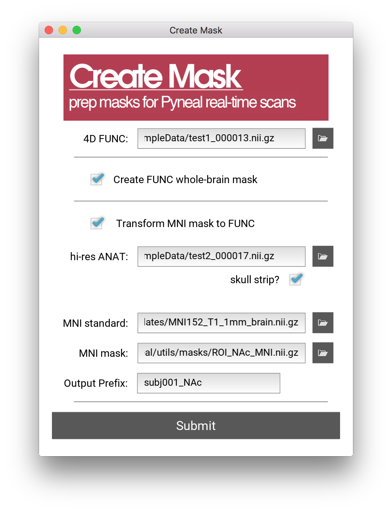

# Creating Masks

**Pyneal** requires that you input a mask for use during real-time analysis. This mask must have the same voxel dimensions and image orientation as the incoming functional data. 

The `createMask.py` tool will assist you in quickly creating these masks during a real-time session. 

**createMask** provides you with two mask creation options:

* **Whole Brain Mask**: This option will create a whole brain mask from the functional data you supply. 

* **Transform mask from MNI space**: This option will take a mask defined in MNI space and transform it to the dimensions and orientation of the functional data you supply.

*Note:* Behind the scenes, createMask.py relies on various functions from FSL. Make sure you have installed [FSL 5.0](https://fsl.fmrib.ox.ac.uk/fsl/fslwiki)

## Launching createMask
The createMask tool is found in `pyneal/utils/createMask.py`

You can launch the createMask GUI by navigating to the `utils` directory via the terminal and running `createMask.py` with Python

> cd utils  
> python createMask.py

## Specifying a reference 4D functional file

In order to create masks, we need to know the voxel size, 3D volume dimensions, and image orientation of the functional data for the current session. The easiest way to get this data is to include a brief (30sec or less) functional scan near the beginning of your session. Use the exact same slice prescriptions and image settings as you plan to use during your real-time scans. 

After the scan has finished, use the `getSeries.py` tool from **Pyneal Scanner** to convert the images to a 4D nifti file. Note that `getSeries.py` will automatically reorient the output data to RAS+ orientation. Thus, by using this data as our reference functional data we will create a mask that is also in RAS+. This is good since, during a real-time run, **Pyneal** will be receiving data in RAS+ orientation (see [image orientation](/imageOrientation) for more info) 

## Deciding on a mask type

### Whole Brain Mask

### Transform MNI space masl

