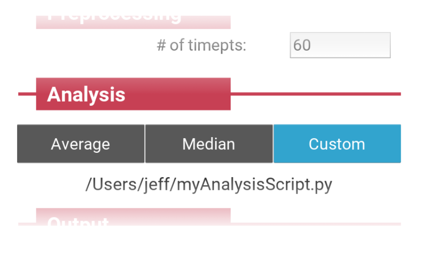

# Customized Analyses

One of **Pyneal's** most powerful features is its ability to run customized analyses during a real-time scan. This means you can design your own analyses to fit your unique experimental needs, and **Pyneal** will execute those analyses on every new timepoint and store the results. 

To take advantage of this feature, you write a custom analysis script (in `python`), and select the `Custom` button in the Analysis pane of the GUI:




## Custom Analysis Script

While custom analyses offer a lot of flexibility, there are a couple of important constraints that need to be included in the script to ensure it can be integrated into the typical **Pyneal** data flow. 

The best way to ensure these constraints are met is to base your script off of the template file included with **Pyneal**. You can find this template in 

`pyneal/utils/customAnalyses/customAnalysisTemplate.py`

Or, you can simply copy the text here:

```python
import sys
import os
from os.path import join
import logger

import numpy as np

class CustomAnalysis:
    def __init__(self, mask_img):
        """
        Everything in the __init__ class will be executed BEFORE the scan begins
        """
        # local reference to MASK from Pyneal setup GUI
        self.mask = mask_img

        # Add the directory that this script lives in to the path. This way it
        # is easy to load any additional files you want to put in the same
        # directory as your custom analysis script
        self.customAnalysisDir = os.path.abspath(os.path.dirname(__file__))
        sys.path.append(self.customAnalysisDir)

        # Import the logger. If desired, you can write log messages to the
        # Pyneal log file using:
        # self.logger.info('my log message') - log file and stdOut
        # self.logger.debug('my log message') - log file only
        self.logger = logging.getLogger('PynealLog')

        ########################################################################
        ############# vvv INSERT USER-SPECIFIED CODE BELOW vvv #################
        self.myResult = 1


        ############# ^^^ END USER-SPECIFIED CODE ^^^ ##########################
        ########################################################################


    def compute(self, volume, volIdx):
        """
        Code that will be executed on EACH new 3D volume that arrives DURING the
        real-time scan. Results must be returned in a dictionary. No restrictions
        on dict key names or values, but note that the volume index will get added
        automatically by Pyneal before the result gets placed on the results
        server, so no need to specify that here
        """
        ########################################################################
        ############# vvv INSERT USER-SPECIFIED CODE BELOW vvv #################
        self.myResult += 1


        ############# ^^^ END USER-SPECIFIED CODE ^^^ ##########################
        ########################################################################

        return {'result': self.myResult}
```

The script class consists of a single class (`CustomAnalysis`) with two methods: `__init__` and `compute`. You are welcome to include any additional methods that are useful, just make sure these two methods exist. See below for details on what each method does and how to customize them. 

### `__init__` (initialize)

The `__init__` method is called as soon as you hit `submit` on the setup GUI. In other words, the code in this method runs *before* the scan begins. Thus, the `__init__` method is where you will specify any set up code that needs to be initialized before the scan begins (e.g. loading multiple mask files).

Let's take a look at the code in more detail:

```python
def __init__(self, mask_img):
    """
    Everything in the __init__ class will be executed BEFORE the scan begins
    """
    # local reference to MASK from Pyneal setup GUI
    self.mask = mask_img

    # Add the directory that this script lives in to the path. This way it
    # is easy to load any additional files you want to put in the same
    # directory as your custom analysis script
    self.customAnalysisDir = os.path.abspath(os.path.dirname(__file__))
    sys.path.append(self.customAnalysisDir)

    # Import the logger. If desired, you can write log messages to the
    # Pyneal log file using:
    # self.logger.info('my log message') - log file and stdOut
    # self.logger.debug('my log message') - log file only
    self.logger = logging.getLogger('PynealLog')

    ########################################################################
    ############# vvv INSERT USER-SPECIFIED CODE BELOW vvv #################
    self.myResult = 1


    ############# ^^^ END USER-SPECIFIED CODE ^^^ ##########################
    ########################################################################
```    

First, note that a reference to the mask file specified in the GUI (`mask_img`) is passed into this class. 

### `compute` 