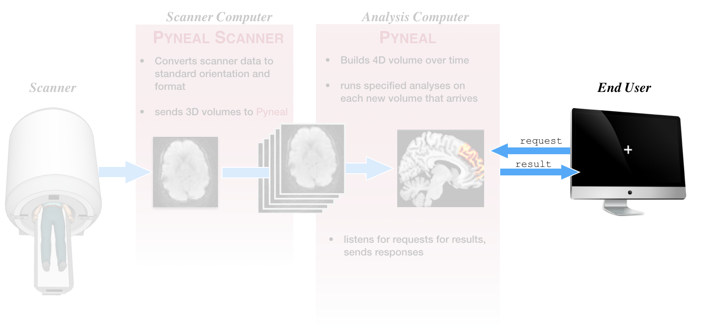
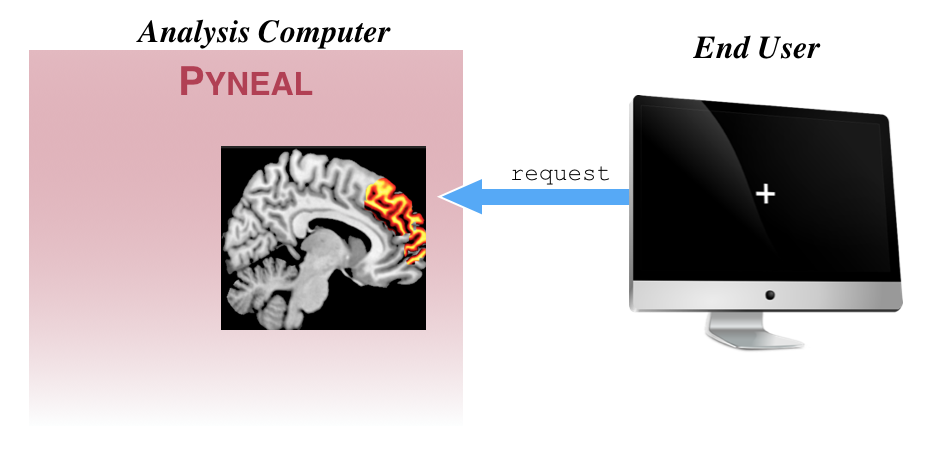

We refer to *any* component that requests results from **Pyneal** during a scan as an **End User**. For instance, a potential **End User** could be task presentation software that periodically makes requests for analysis results in order to update a neurofeedback display for the participant. 

## Sending requests


Sending a request to **Pyneal** for the results from a specific volume simply requires you to establish a connection to **Pyneal** and send the index value of the volume you'd like to request (0-based index). The volume index should be formatted as a 4-character string, with zero-padded as needed. For instance, to request the results from the 9th volume (i.e. index 8), the request would be formatted as `0008`. 

Here is an example, written in `python` for how you might *send* a request for the 9th volume:

```
import socket

# socket configs
host = '127.0.0.1'  # Pyneal address
port = 5556     # results server port number

# connect to the results server of Pyneal
clientSocket = socket.socket(socket.AF_INET, socket.SOCK_STREAM)
clientSocket.connect((host, port))

# format request for the 9th volume (index 8).
request = '0008'

# send the request
clientSocket.send(request.encode())
```
This approach can be incorporated into any **End User** application (e.g. an experimental task) to request specific results throughout a scan. 


## Parsing Responses


Continuing from the previous section, once the results server on **Pyneal** *receives* a request for volume index `0008`, it will check to see if that volume has arrived and been analyzed yet.

* If the volume **has not** arrived, the response will be a JSON message that contains a single key:value pair: `"foundResults":False`

* If the volume ***has*** arrived, the response will be a JSON message that contains the key:value pair `"foundResults":True` as well all of the results key:value pairs for that volume. For instance, if the real-time analysis is set to compute the average activation with the selected mask, the response message for volume `0008` may look like `{'foundResults': True, 'average':2432}`. If you are using a custom analysis script that computes multiple results on each volume, all of those results will appear in the response message. For instance, if you have a custom analysis script that is computing the mean activation separately in 3 ROIs, the response message may look like `{'foundResults': True, "roi1_average": 2149.81, "roi2_average": 2519.11, "roi3_average": 2543.61}`

Since the length of the response message can vary depending on A) whether the results were found or not, and B) the number of results that are being returned, the response itself will get sent to the remote **End User** in 2 waves:

1) First, a header that simply reports the number of characters in the upcoming response message. 

2) The response message itself. 

This way, the **End User** can know precisely how many bytes to read from the socket connection. 

For reference, here is the code that the results server uses to send responses:


```
def sendResults(self, connection, results):
    """
    Format the results dict to a json string, and send results to the client.
    Message will be sent in 2 waves: first a header indicating the msg length,
    and then the message itself
    """
    # format as json string and then convert to bytes
    formattedMsg = json.dumps(results).encode()

    # build then send header with info about msg length
    hdr = '{:d}\n'.format(len(formattedMsg))
    connection.send(hdr.encode())

    # send results as formatted message
    connection.sendall(formattedMsg)
    self.logger.debug('Sent result: {}'.format(formattedMsg))
```

## Example Responses

Here are some example of what the JSON responses might look like using different analysis options. 

* **Results were not found**: The **End User** requested a volume that has not arrived or been analyzed yet:

	`{'foundResults': False}`
	
### Pyneal Built-in Analysis Options

* **Average** (from GUI): compute the average signal within the specified mask:

	`{'foundResults': True, 'average':2432}`

* **Weighted Average** (from GUI): compute the weighted average within the specified mask, using mask voxels values as weights ("Weighted Mask?" is checked in GUI):

	`{'foundResults': True, 'weightedAverage':2432}`
	
* **Median** (from GUI): compute the median signal within the specified mask:

	`{'foundResults': True, 'median':2432}`

* **Weighted Median** (from GUI): compute the weighted median within the specified mask, using mask voxel values as weights ("Weighted Mask?" is checked in GUI):

	`{'foundResults': True, 'weightedMedian':2432}`
	

### Using Custom Analyses

The JSON responses from custom analyses will vary based on your custom analysis script. At a minimum, all responses will contain the `'foundResults'` entry. 

For instance, if you have a custom analysis script that is computing the mean activation separately in 3 ROIs, the response message may look like:

* `{'foundResults': True, "roi1_average": 2149.81, "roi2_average": 2519.11, "roi3_average": 2543.61}`