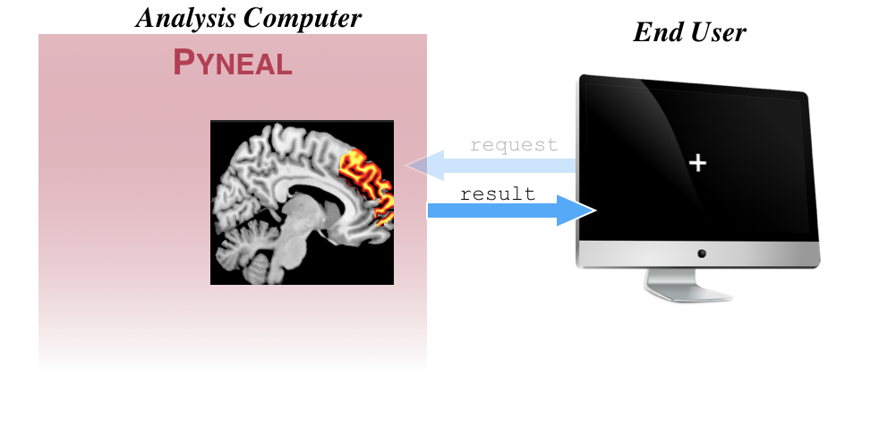

We refer to *any* component that requests results from **Pyneal** during a scan as an **End User**. For instance, a potential **End User** could be task presentation software that periodically makes requests for analysis results in order to update a neurofeedback display for the participant. 

## Sending requests


Sending a request to **Pyneal** for the results from a specific volume simply requires you to establish a connection to **Pyneal** and send the index value of the volume you'd like to request (0-based index). The volume index should be formatted as a 4-character string, with zero-padded as needed. For instance, to request the results from the 9th volume (i.e. index 8), the request would be formatted as `0008`. 

Here is an example, written in `python` for how you might *send* a request for the 9th volume:

```
import socket

# socket configs
host = '127.0.0.1'  # Pyneal address
port = 5556     # results server port number

# connect to the results server of Pyneal
clientSocket = socket.socket(socket.AF_INET, socket.SOCK_STREAM)
clientSocket.connect((host, port))

# format request for the 9th volume (index 8).
request = '0008'

# send the request
clientSocket.send(request.encode())
```
This approach can be incorporated into any **End User** application (e.g. an experimental task) to request specific results throughout a scan. 


## Parsing Responses

