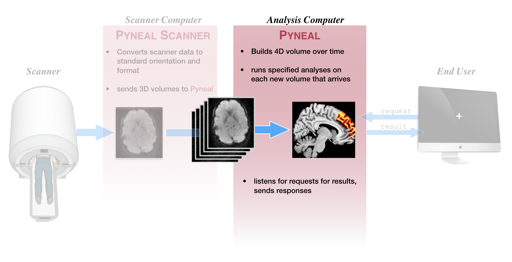
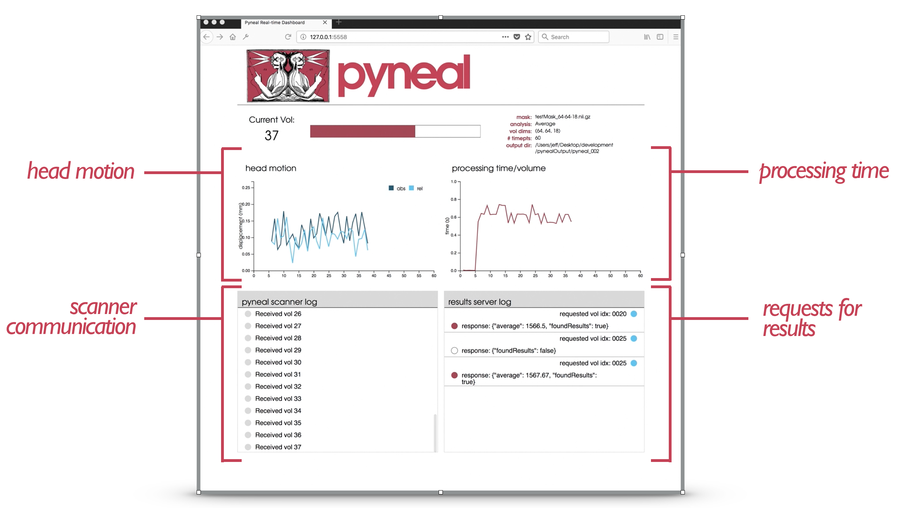

# Pyneal

First step, make sure you've followed the instructions at [**setup: Pyneal**](setup.md#pyneal) to configure **Pyneal** to your environment. 

## Basic Usage

## How it works

## Preparing for a real-time scan

### Creating Masks
Pyneal requires the user to supply a mask that will specify which voxels to include during the real-time analysis. 

This mask can take any form you want, with the caveat that it *must* be in the same space (i.e. voxel size, slice dimensions, and orientation) as the incoming functional data throughout the real-time scan. One way to ensure this would to collect a short localizer scan at the beginning of the session that has the desired scan parameters, and use this data to create/register/align your mask for the subsequent real-time runs. 

**Examples:**

* **Mask from functional ROI**: You could include a mask that represents voxels with significant task-induced activation from the current subject. To do so, include a quick localizer task at the beginning of your session that you can access offline (for instance, by using the `getSeries.py` tool in **Pyneal Scanner**) and analyze. Threshold and/or binarize the resulting statistical maps as appropriate, and create a funtional ROI mask file. 

* **Mask from anatomical ROI**: You can create a subject-specific anatomical ROI mask by transforming a preselected MNI space mask to the participant's functional space. **Pyneal** includes an automated tool to assist in this process. See [**Creating Masks**](/createMask.md) under *Additonal Tools* 

### Choosing Analyses

## Running a real-time scan

To launch **Pyneal** from the **analysis computer**, open the command line and navigate to the `pyneal` directory. From the `pyneal` directory, type:

> python pyneal.py

The GUI will appear, allowing you to enter the appropriate settings for your environment/session:

Once you hit submit, the command line will print a message showing you where log files for the current series will be stored, as well as all of the configuration settings for this series:

> Logs written to: /path/to/outputDir/pyneal_001/pynealLog.log      
> MainThread -  Setting: analysisChoice: Average  
> MainThread -  Setting: dashboardClientPort: 5558  
> MainThread -  Setting: dashboardPort: 5557  
> MainThread -  Setting: launchDashboard: True   
> MainThread -  Setting: maskFile: /path/to/maskFile.nii.gz   
> MainThread -  Setting: maskIsWeighted: False  
> MainThread -  Setting: numTimepts: 60  
> MainThread -  Setting: outputPath: /path/to/outputDir    
> MainThread -  Setting: pynealHost: 127.0.0.1  
> MainThread -  Setting: pynealScannerPort: 5555  
> MainThread -  Setting: resultsServerPort: 5556  
> MainThread -  Setting: seriesOutputDir: /path/to/outputDir/pyneal_001  

At the end of the message, you'll see a status indicator for the various subcomponents of **Pyneal**:

> --------------------  
> MainThread -  ScanReceiver Server alive and listening....  
> Waiting for connection from pyneal_scanner  
> MainThread -  Results Server alive and listening....  

If everything is working properly, it'll say that both the `ScanReceiver Server` and `Results Server` are alive and listening. (for more information about what these components are doing, see [**Pyneal (detailed)**](pyneal.md). 

You should also see a message indicating that **Pyneal** is waiting to connect to **Pyneal Scanner**. Once you launch **Pyneal Scanner**, this message will update to:

> Received message:  hello from pyneal_scanner  

In addition to the command line output, you can monitor the status of the scan from the web-based dashboard. 

### Dashboard

The dashboard will launch automatically, but if you happen to close the window you can relaunch it at any time during the scan by opening a webbrowser and entering the URL `127.0.0.1:<dashboardClientPort>`, where `<dashboardClientPort>` can be found from series configuration settings that are printed to the command line. For example, using the settings from above, the URL would be: `127.0.0.1:5558`

The dashboard contains:

* progress bar indicating the % completed of the current scan
* head motion plot showing relative (to ref volume) and absolute displacement (in mm)
* scanner communication log showing volume indices as they arrive from the scanner
* processing time plot showing processing time per volume (in sec)
* request log showing incoming requests for results and each corresponding reply  

After the scan has completed, the `seriesOutputDir` will contain the folling output files:

* `pynealLog.log` - detailed log messages from the current scan
* `results.json` - JSON formatted file containg all of the analysis results from the current scan
* `receivedFunc.nii.gz` - nifti formatted 4D file containing the series data itself, as received by **Pyneal**, from the current scan  

## After a real-time scan

## Pyneal subcomponents

### scanReceiver

### resultsServer

