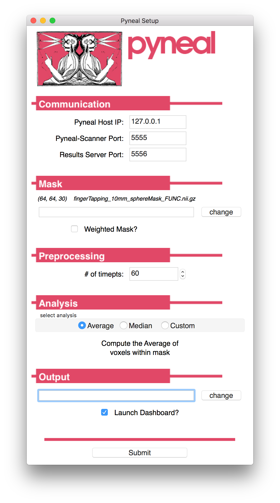
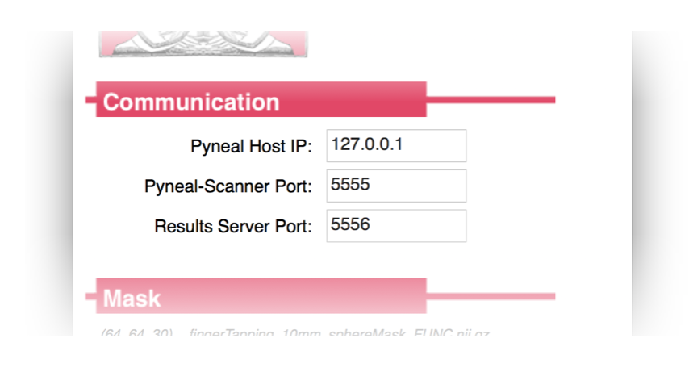
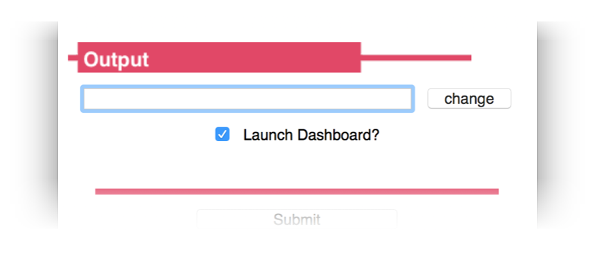
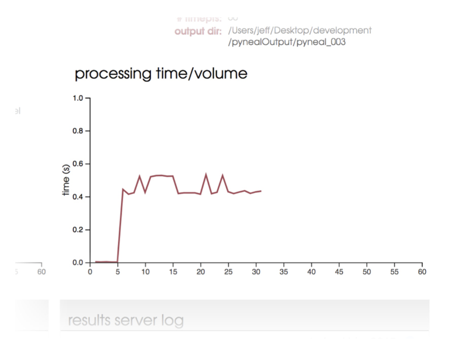

# Pyneal


First step, make sure you've followed the instructions at [**setup: Pyneal**](setup.md#pyneal) to configure **Pyneal** to your environment. 

## Basic Usage

To launch **Pyneal** from the **analysis computer**, open a terminal and navigate to the `pyneal` directory. From there, type:

> python3 pyneal.py

This will launch a GUI that will allow you to set up **Pyneal** for a particular real-time scan. Once you hit submit, a dashboard will appear (if selected in the GUI) that allows you to monitor the progress of your scan. Additional log messages will appear in the terminal throughout the scan. 

See below for a more detailed description of how to [**prepare for a real-time scan**](pyneal.md#preparing-for-a-real-time-scan), what's going on [**during a real-time scan**](pyneal.md#running-a-real-time-scan), and what type of data is available [**after a real-time scan**](pyneal.md#after-a-real-time-scan) 


## Preparing for a real-time scan

### Network settings
By this point, if you have followed the [**setup**](setup.md) instructions for both **Pyneal Scanner** and **Pyneal** you will have delegated one machine to be the **scanner computer** and one machine to be the **analysis computer**. It is imperative that **Pyneal Scanner** and **Pyneal** can communicate with one another during a scan. That is, the **scanner computer** must be able to connect to the **analysis computer** over an available network port. 

Different scanning environments will have different configurations (see [**setup: setting up your network**](setup.md#setting-up-your-network) for more details). Regardless of your setup, make sure you know the IP address you will use for **Pyneal**, as well as the port numbers to use for communication with **Pyneal Scanner** and any remote **End User**.  


### Creating Masks
Pyneal requires the user to supply a mask that will specify which voxels to include during the real-time analysis. 

This mask can take any form you want, with the caveat that it *must* be in the same space (i.e. voxel size, slice dimensions, and orientation) as the incoming functional data throughout the real-time scan. One way to ensure this would to collect a short localizer scan at the beginning of the session that has the desired scan parameters, and use this data to create/register/align your mask for the subsequent real-time runs. 

**Examples:**

* **Mask from functional ROI**: You could include a mask that represents voxels with significant task-induced activation from the current subject. To do so, include a quick localizer task at the beginning of your session that you can access offline (for instance, by using the `getSeries.py` tool in **Pyneal Scanner**) and analyze. Threshold and/or binarize the resulting statistical maps as appropriate, and create a funtional ROI mask file. 

* **Mask from anatomical ROI**: You can create a subject-specific anatomical ROI mask by transforming a preselected MNI space mask to the participant's functional space. **Pyneal** includes an automated tool to assist in this process. See [**Additional Tools: Creating Masks**](/createMask.md). Your chosen source MNI mask can be a binary anatomical mask or a weighted probablistic mask. When you load the functional space mask into **Pyneal** you will have the option of preserving voxel weights. 


### Choosing Analyses

Prior to beginning a real-time project, determine what type of analysis is most appropriate to your project, and whether the built-in analysis routines will suffice or whether it'd be more appropriate to use a custom analysis script. 

**Pyneal** has built-in analysis tools that can compute simple descriptive summaries (e.g. mean, median) from a single ROI. However, by using a custom analysis script, you can develop unique and complex analyses, targeting one or more ROIs, that will execute on every incoming volume during the scan. 

See [**Additional Tools: Customized Analyses**](/customAnalysis.md)

## Running a real-time scan

To launch **Pyneal** from the **analysis computer**, open the command line and navigate to the `pyneal` directory. From the `pyneal` directory, type:

> python pyneal.py

The GUI will appear, allowing you to enter the appropriate settings for your environment/session:

### Set-up GUI



Launching the GUI will load the settings from previous run. For running multiple scans in the same session, you may not need to change any settings after the first scan. 

If you **do** need to change settings, you can do so manually via each field in the GUI, or you can click `Load Settings` to load a custom `.yaml` configuration file. A custom settings file must contain one or more of the required configuration key:value pairs; see [**Setup: Pyneal**](setup.md#pyneal) for more details on the **Configuration Keys**. Any configuration keys ***not*** specified in the custom settings file will be set using default values.   

The GUI presents a number of options that can be customized to your project/enviroment:

#### Communication


The **Communication** panel is where you specify the network settings for communication between **Pyneal Scanner**, **Pyneal**, and any remote **End User**. 

* **Pyneal Host IP**: The IP address of the machine running **Pyneal** (i.e. the **analysis machine**). This is the IP address that **Pyneal Scanner** will try to connect to, as well as any remote **End User** that is making requests for results.  
* **Pyneal-Scanner Port**: The port number over which **Pyneal** will be listening for incoming data from **Pyneal Scanner**. 
* **Results Server Port**: The port number that **Pyneal** will use to set up the **Results Server**. Remote machines that wish to retrieve real-time analysis output during a scan can send requests over this port number. 


#### Mask


Specify the path to mask file (Nifti - .nii/.nii.gz) to be used during real-time analysis. During the analysis stage, each incoming 3D volume will be masked to remove non-relevant voxels. The mask *must* match the dimensions and orientation of incoming functional data (see [**Creating Masks**](/createMask.md) for Real-time Analysis).

* If **Weighted Mask?** is checked, the voxel values will be used as weights and passed along to the analysis stage.
* For a **Custom** analysis in which you want to use 2 or more ROIs, you should set your custom analysis script to load the desired ROIs. In that situation, you should choose a mask file here that represents a whole brain mask (see [**Creating Masks**](/createMask.md) for Real-time Analysis). 

#### Preprocessing


Specify how many timepoints will be in the upcoming series. The other dimensions of the dataset (i.e. slice dimensions, number of slices per vol) will be determined automatically from the incoming data. 

#### Analysis


Choose the analyses you want to carry out during the real-time run

* **Average**: Built-in analysis routine. Compute the mean activation over all voxels in the **Mask** specified above. The results will be stored as a dictionary under the key name `average`. If the `Weighted Mask?` option is selected on the **Mask** panel, a *weighted* average will be calculated, using voxel values as weights. In this case, the results will be stored in a dictionary under the key name `weightedAverage`. 
* **Median**: Built-in analysis routine. Compute the median activation value over all voxels in the **Mask** specifed above. The results will be stored in a dictionary under the key name `median`. If the `Weighted Mask?` option is selected on the **Mask** panel, a *weighted* mean will be calculated, using voxel values as weights. (see [**weightedstats**](https://pypi.python.org/pypi/weightedstats/0.2) for algorithm). In this case, the results will be stored in a dictionary under the key name `weightedMedian`. 
*  **Custom**: Load a custom analysis script. The analysis algorithms specified in the script will be executed on every incoming timepoint during the scan. How the results get stored in the results dictionary throughout a scan is up to your particular script (see [**Custom Analysis Scripts**](customAnalysis.md))

#### Output


Specify a path to an output directory for the current *session*. Within this output directory, the results and log files for each new series will be written to unique subdirectories, starting with `pyneal_001` for the first series and named sequentially thereafter. 

* **Launch Dashboard?**: Option for whether to present a dashboard during the real-time scan or not. If selected, the dashboard will launch automatically upon submission. However, if you happen to close it for any reason, you can access it by pointing a web browser to `127.0.0.1:5558` (Note: `5558` is the `dashboardClientPort` number. To confirm the correct port, check the settings that are printed to the terminal once you hit `Submit` from the setup GUI (see [**Command line output**](pyneal.md#command-line-output) below). For more information on using the Dashboard, see [**Dashboard**](pyneal.md#dashboard) below). 


### Command line output
Once you hit submit, the command line will print a message showing you where log files for the current series will be stored, as well as all of the configuration settings for this series:

> Logs written to: /path/to/outputDir/pyneal_001/pynealLog.log      
> MainThread -  Setting: analysisChoice: Average  
> MainThread -  Setting: dashboardClientPort: 5558  
> MainThread -  Setting: dashboardPort: 5557  
> MainThread -  Setting: launchDashboard: True   
> MainThread -  Setting: maskFile: /path/to/maskFile.nii.gz   
> MainThread -  Setting: maskIsWeighted: False  
> MainThread -  Setting: numTimepts: 60  
> MainThread -  Setting: outputPath: /path/to/outputDir    
> MainThread -  Setting: pynealHost: 127.0.0.1  
> MainThread -  Setting: pynealScannerPort: 5555  
> MainThread -  Setting: resultsServerPort: 5556  
> MainThread -  Setting: seriesOutputDir: /path/to/outputDir/pyneal_001  

At the end of the message, you'll see a status indicator for the various subcomponents of **Pyneal**:

> --------------------  
> MainThread -  ScanReceiver Server alive and listening....  
> Waiting for connection from pyneal_scanner  
> MainThread -  Results Server alive and listening....  

If everything is working properly, it'll say that both the `ScanReceiver Server` and `Results Server` are alive and listening. (for more information about what these components are doing, see [**Pyneal Subcomponents**](pyneal.md#pyneal-subcomponents) below). 

You should also see a message indicating that **Pyneal** is waiting to connect to **Pyneal Scanner**. Once you launch **Pyneal Scanner**, this message will update to:

> Received message:  hello from pyneal_scanner  

Throughout the scan, the terminal will update with status and log messages reporting on-going processes. In addition to the command line output, you can monitor the status of the scan from the web-based dashboard. 

### Dashboard


The dashboard will launch automatically, but if you happen to close the window you can relaunch it at any time during the scan by opening a webbrowser and entering the URL `127.0.0.1:<dashboardClientPort>`, where `<dashboardClientPort>` can be found from series configuration settings that are printed to the command line. For example, using the settings from above, the URL would be: `127.0.0.1:5558`

The top of the dashboard contains a progress bar indicating the % completed of the current scan, as well as additional settings and details. Lower down, the dashboard contains:

#### Head Motion Plot


Plot displaying head motion throughout the scan. Head motion is expressed in both absolute displacement (*abs*, dark blue) from a fixed reference volume (typically the 4th volume in the series), as well as relative displacement (*rel*, light blue) relative to the previous volume. 

Head motion estimates are based on [histogram registration](http://nipy.org/nipy/api/generated/nipy.algorithms.registration.histogram_registration.html) algorithms, and are applied to fMRI data using a similar approach as found in [https://github.com/cni/rtfmri/blob/master/rtfmri/analyzers.py](https://github.com/cni/rtfmri/blob/master/rtfmri/analyzers.py)

#### Processing Time Plot


Plot displaying the processing time per volume throughout a scan. You can use this plot to verify that your analyses are successfully keeping pace with the TR of data collection.

#### Pyneal Scanner Log


Simple log message area indicating incoming volumes from **Pyneal Scanner** as they arrive. 

#### Results Server Log


A log window allowing you to monitor communication between **Pyneal** (specifically, the results server) and any remote **End User**. Each request for results sent from an **End User** will appear on the right half of the log window, along with a blue circle and details as to which volume the results are requested from. 

The response from the results server will be shown immediately below each request, left-aligned within the log window. 

* If the requested results are found, the status circle will be maroon, and you will see the JSON message that was returned to the **End User**. The JSON message will contain a key:value pair indicating the requested results were found (`"foundResults":true`), as well as other key:value pairs containing the results themselves. 

* If the requested results are not found (for instance, if the requested volume has not arrived and been analyzed yet), the status circle will be grey, and you will see a returned JSON message with a single key:value pair indicating that the results were not found (`"foundResults":false`)

For more info, see [**sending requests**](endUser.md#sending-requests) and [**parsing responses**](endUser.md#parsing-responses)


## After a real-time scan

After the scan has completed, all output files will be found in a unique subdirectory for each scan. Subdirectories will appear within the `Output Directory` that was specified in the **Pyneal** setup GUI. Subdirectories follow the naming convention `pyneal_###`, staring with `pyneal_001` for the first scan, and named sequentially thereafter.

***Note:*** you can find the full path to the unique series output directory in the command line output for this series:

> MainThread -  Setting: seriesOutputDir: /path/to/outputDir/pyneal_001  

The series output directory has the following structure:

```
<seriesOutputDir>
		└── pyneal_001
			├── pynealLog.log
			├── receivedFunc.nii.gz
			└── results.json
```

Each series will contain the following output files:

* `pynealLog.log` - detailed log messages from the current series
* `results.json` - JSON formatted file containg all of the analysis results from the current series. (see below on [**Interpreting the results file**](pyneal.md#interpreting-the-results-file) for more info) 
* `receivedFunc.nii.gz` - nifti formatted 4D file containing the series data itself, as received by **Pyneal**, from the current series  


### Interpreting the results file
The results from the analyses computed in real-time will be stored in the output directory in a file named `results.json`

This file will have an entry for every volume in the series, and each entry will contain a nested JSON object that has all of the results for that particular volume. For instance, if the real-time analysis is calculating the average signal within the mask, the results file would look like:

```
{
"0":
	{"average": 2149.81},
"1":
	{"average": 2234.32},
"2":
	{"average": 1981.45},
.
.
.
}
```

Note that the top-level keys are volume indices that use a 0-based index. 

In the above example, we're computing a single result on every volume (i.e. "average"). However, if you are using a custom analysis script that is computing multple results on every volume, the same idea holds, and you'll see all of those results for each volume. For instance, if you have a custom analysis script that is computing the mean activation separately in 3 ROIs, the results may look like:

```
{
"0":
	{
	"roi1_average": 2149.81, 
	"roi2_average": 2519.11, 
	"roi3_average": 2543.61
	},
"1":
	{
	"roi1_average": 1884.51, 
	"roi2_average": 2341.43, 
	"roi3_average": 2253.67
	},
"2":
	{
	"roi1_average": 2001.76, 
	"roi2_average": 2214.23, 
	"roi3_average": 2877.17
	},
.
.
.
}
```

## Pyneal subcomponents

### scanReceiver

### resultsServer


