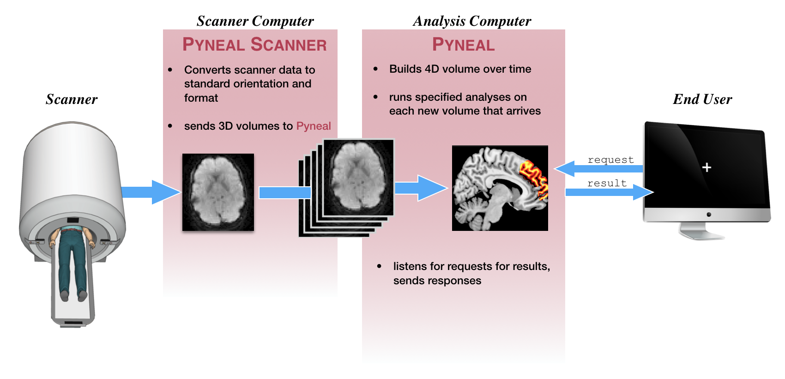

# Quick Overview
This section will provide a quick overview of running a scan with Pyneal. The aim is to  familiarize you with the interface and commands you would use during a scan session, without getting lost in the details about what is happening underneath the hood. 

For a more in-depth discussion of the main components, see [**Pyneal Scanner**](/pynealScanner.md) and [**Pyneal**](/pyneal.md).

## Data flow
This schematic gives a very broad overview of the path that data follows throughout a real-time scan with **Pyneal**

* Once the scan begins, raw images are collected by **Pyneal Scanner*, and then converted and reoriented to a standardized format (see [**image orientation**](/imageOrientation.md) for more info). 
* **Pyneal Scanner** exports converted 3D volumes to **Pyneal**.
* **Pyneal** receives 3D volumes, and concatenates them into a 4D volume over time throughout the scan. With every new 3D volume that arrives, **Pyneal** will **preprocess** the volume, and run any specified analyses. 
* The analysis results for each volume are stored on a separate server, which listens for requests from remote end users or devices throughout the scan (see [**requesting results**](/pyneal.md#requesting-results) for more info). 
* Anytime a request is received, the server checks to see if that volume has been processed yet. If so, it returns the results; if not, it sends a message saying that volume has not been processed yet

## Prior to the scan...

* Make sure you have followed the [**installation**](/installation.md) and [**setup**](/setup.md) instructions. 

* Figure out the IP address of the machine that is going to be the **analysis computer** running **Pyneal**. You'll need this address in order to configure **Pyneal Scanner**, as well as to request any results during the scan itself. This IP address must be accessible from the same network as the **scanner computer** (and any **end user** computer that will be making requests to **Pyneal** for results during the scan)

* Determine the port numbers to use for commmuncation. Pyneal will need to have one available port number dedicated for communication with **Pyneal Scanner**, and an additional port number dedicated for communication with remote end users or devices. 
	* If you don't know which port numbers to use, try choosing ones in the range of 1024-49151. If you happen to choose a port number that is already in use, **Pyneal** will return an error message. In that event, try a different number. 

* Once you have determined the IP address and port numbers to use with **Pyneal** on the **analysis computer**, complete the [**set up steps for Pyneal Scanner**](/setup.md#pyneal-scanner)
