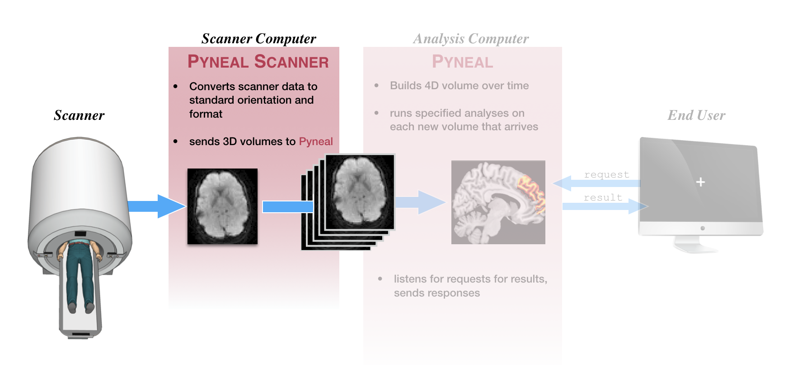
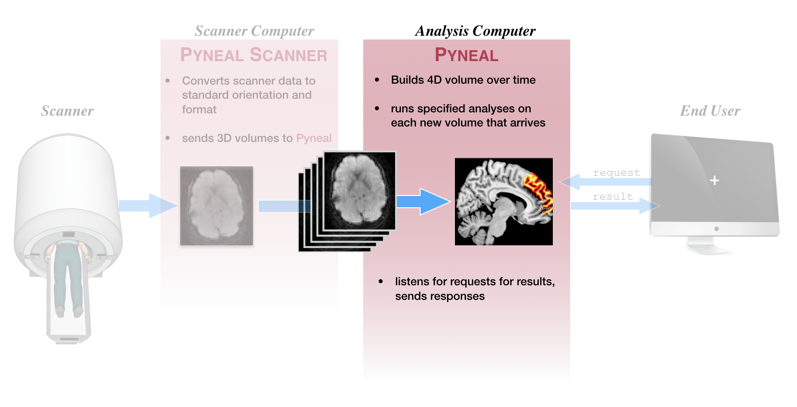

# Quick Overview
This section will provide a quick overview of running a scan with Pyneal. The aim is to  familiarize you with the interface and commands you would use during a scan session, without getting lost in the details about what is happening underneath the hood. 

For a more in-depth discussion of the main components, see [**Pyneal Scanner**](/pynealScanner.md) and [**Pyneal**](/pyneal.md).

## Data flow
This schematic gives a very broad overview of the path that data follows throughout a real-time scan with **Pyneal**

* Once the scan begins, raw images are collected by **Pyneal Scanner**, and then converted and reoriented to a standardized format (see [**image orientation**](/imageOrientation.md) for more info). 
* **Pyneal Scanner** exports converted 3D volumes to **Pyneal**.
* **Pyneal** receives 3D volumes, and concatenates them into a 4D volume over time throughout the scan. With every new 3D volume that arrives, **Pyneal** will **preprocess** the volume, and run any specified analyses. 
* The analysis results for each volume are stored on a separate server, which listens for requests from remote end users or devices throughout the scan (see [**requesting results**](/pyneal.md#requesting-results) for more info). 
* Anytime a request is received, the server checks to see if that volume has been processed yet. If so, it returns the results; if not, it sends a message saying that volume has not been processed yet

## Pyneal Scanner

First step, make sure you've followed the instructions at [**setup: Pyneal Scanner**](setup.md#pyneal-scanner) to configure **Pyneal Scanner** to your environment. 

To launch **Pyneal Scanner** from the **scanner computer**, open the command line and navigate to the `pyneal_scanner` directory. From the `pyneal_scanner` directory, type:

> python pynealScanner.py

If you have set up **Pyneal Scanner** correctly, you will see a print out of your settings, info about any existing series directories in the `scannerBaseDir` path, and a message that **Pyneal Scanner** is attempting to connect to **Pyneal** over the specified `pynealSocket`:

> ===============  
> SCANNER SETTINGS:  
> pynealSocketHost: 127.0.0.1  
> pynealSocketPort: 5555  
> scannerBaseDir: /path/to/scanner/baseDir  
> scannerMake: GE    
> ============     
> Session Dir:  
> /path/to/scanner/baseDir/p1/e666  
> Series Dirs:  
> 		s1923	 23.6 MB	5 min, 13 s ago  
> 		s1925	 26.2 MB	1 min, 10 s ago    
> MainThread -  Connecting to pynealSocket...  

Once you launch **Pyneal** on the **analysis computer**, you will see a confirmation that **Pyneal Scanner** has connected to **Pyneal**, and is now waiting for new data to arrive from the scanner:

> MainThread -  pynealSocket connected  
> MainThread -  Waiting for new seriesDir...

For a more detailed look at how **Pyneal Scanner** works, see [**Pyneal Scanner (detailed)**](pynealScanner.md)

## Pyneal

First step, make sure you've followed the instructions at [**setup: Pyneal**](setup.md#pyneal) to configure **Pyneal** to your environment. 

To launch **Pyneal** from the **analysis computer**, open the command line and navigate to the `pyneal` directory. From the `pyneal` directory, type:

> python pyneal.py

The GUI will appear, allowing you to enter the appropriate settings for your environment/session:

Once you hit submit, the command line will print a message showing you where log files for the current series will be stored, as well as all of the configuration settings for this series:

> Logs written to: /path/to/outputDir/pyneal_001/pynealLog.log      
> MainThread -  Setting: analysisChoice: Average  
> MainThread -  Setting: dashboardClientPort: 5558  
> MainThread -  Setting: dashboardPort: 5557  
> MainThread -  Setting: launchDashboard: True   
> MainThread -  Setting: maskFile: /path/to/maskFile.nii.gz   
> MainThread -  Setting: maskIsWeighted: False  
> MainThread -  Setting: numTimepts: 60  
> MainThread -  Setting: outputPath: /path/to/outputDir    
> MainThread -  Setting: pynealHost: 127.0.0.1  
> MainThread -  Setting: pynealScannerPort: 5555  
> MainThread -  Setting: resultsServerPort: 5556  
> MainThread -  Setting: seriesOutputDir: /path/to/outputDir/pyneal_001  

At the end of the message, you'll see a status indicator for the various subcomponents of **Pyneal**:

> --------------------  
> MainThread -  ScanReceiver Server alive and listening....  
> Waiting for connection from pyneal_scanner  
> MainThread -  Results Server alive and listening....  

If everything is working properly, it'll say that both the `ScanReceiver Server` and `Results Server` are alive and listening. (for more information about what these components are doing, see [**Pyneal (detailed)**](pyneal.md). 

You should also see a message indicating that **Pyneal** is waiting to connect to **Pyneal Scanner**. Once you launch **Pyneal Scanner**, this message will update to:

> Received message:  hello from pyneal_scanner  

In addition to the command line output, you can monitor the status of the scan from the web-based dashboard. 

The dashboard will launch automatically, but if you happen to close the window you can relaunch it at any time during the scan by opening a webbrowser and entering the URL `127.0.0.1:<dashboardClientPort>`, where `<dashboardClientPort>` can be found from series configuration settings that are printed to the command line. For example, using the settings from above, the URL would be: `127.0.0.1:5558`

The dashboard contains:

* progress bar indicating the % completed of the current scan
* head motion plot showing relative (to ref volume) and absolute displacement (in mm)
* scanner communication log showing volume indices as they arrive from the scanner
* processing time plot showing processing time per volume (in sec)
* request log showing incoming requests for results and each corresponding reply  

After the scan has completed, the `seriesOutputDir` will contain the folling output files:

* `pynealLog.log` - detailed log messages from the current scan
* `results.json` - JSON formatted file containg all of the analysis results from the current scan
* `receivedFunc.nii.gz` - nifti formatted 4D file containing the series data itself, as received by **Pyneal**, from the current scan  

For a more detailed look at how **Pyneal** works, see [**Pyneal (detailed)**](pyneal.md)

## End User

We refer to *any* component that requests results from **Pyneal** during a scan as an **End User**. For instance, a potential **End User** could be task presentation software that periodically makes requests for analysis results in order to update a neurofeedback display for the participant. 

For more details about how to format requests and parse responses, see [**Requesting Results**](pyneal.md#formatting-requests)
