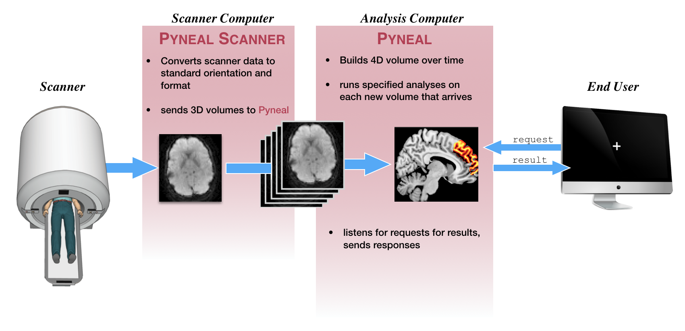

# Quick Overview
This section will provide a quick overview of running a scan with Pyneal. The aim is to  familiarize you with the interface and commands you would use during a scan session, without getting lost in the details about what is happening underneath the hood. 

For a more in-depth discussion of the main components, see [**Pyneal Scanner**](/pynealScanner.md) and [**Pyneal**](/pyneal.md).

## Data flow
This schematic gives a very broad overview of the path that data follows throughout a real-time scan with **Pyneal**

* Once the scan begins, raw images are collected by **Pyneal Scanner**, and then converted and reoriented to a standardized format (see [**image orientation**](/imageOrientation.md) for more info). 
* **Pyneal Scanner** exports converted 3D volumes to **Pyneal**.
* **Pyneal** receives 3D volumes, and concatenates them into a 4D volume over time throughout the scan. With every new 3D volume that arrives, **Pyneal** will **preprocess** the volume, and run any specified analyses. 
* The analysis results for each volume are stored on a separate server, which listens for requests from remote end users or devices throughout the scan (see [**requesting results**](/pyneal.md#requesting-results) for more info). 
* Anytime a request is received, the server checks to see if that volume has been processed yet. If so, it returns the results; if not, it sends a message saying that volume has not been processed yet

## Pyneal Scanner

First step, make sure you've followed the instructions at [**setup: Pyneal Scanner**](setup.md#pyneal-scanner) to configure **Pyneal Scanner** to your environment. 

To launch **Pyneal Scanner** from the **scanner computer**, open the command line and navigate to the `pyneal_scanner` directory. From the `pyneal_scanner` directory, type:

> python pynealScanner.py

If you have set up **Pyneal Scanner** correctly, you will see a print out of your settings, info about any existing series directories in the `scannerBaseDir` path, and a message that **Pyneal Scanner** is attempting to connect to **Pyneal** over the specified `pynealSocket`:

> ===============  
> SCANNER SETTINGS:  
> pynealSocketHost: 127.0.0.1  
> pynealSocketPort: 5555  
> scannerBaseDir: /path/to/scanner/baseDir  
> scannerMake: GE    
> ============     
> Session Dir:  
> /path/to/scanner/baseDir/p1/e666  
> Series Dirs:  
> 		s1923	 23.6 MB	5 min, 13 s ago  
> 		s1925	 26.2 MB	1 min, 10 s ago    
> MainThread -  Connecting to pynealSocket...  

Once you launch **Pyneal** on the **analysis computer**, you will see a confirmation that **Pyneal Scanner** has connected to **Pyneal**, and is now waiting for new data to arrive from the scanner:

> MainThread -  pynealSocket connected  
> MainThread -  Waiting for new seriesDir...

## Pyneal

## End User
