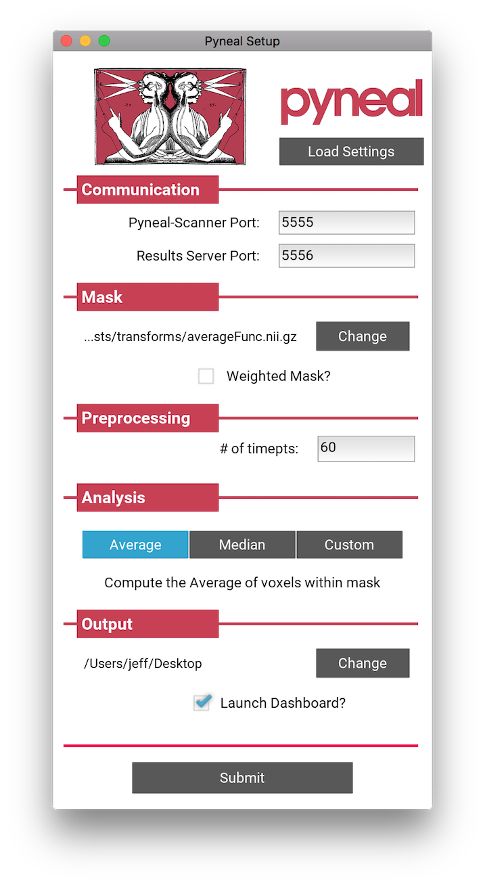

# Setup

The set-up instructions are broken down by **Pyneal Scanner** and **Pyneal**. If you haven't already, follow the [installation instructions](/installation) to configure your environment, and read the section on [definitions](installation/#definitions-used), as those definitions are used throughout these instructions.


## Pyneal Scanner

Copy the `pyneal_scanner` directory to the **scanner computer**.

Launch **Pyneal Scanner** from the command line by navigating in to the `pyneal_scanner` directory and running `pynealScanner.py`


> cd pyneal_scanner  
> python pynealScanner.py


**Pyneal Scanner** uses a set of configuration parameters that you can modify to fit your environment. These are stored in file named `scannerConfig.yaml` in the `pyneal_scanner` directory.

If you're running **Pyneal Scanner** for the first time, this file won't exist yet. You can either create this file manually, or wait until `pynealScanner.py` prompts you to fill in any missing configuration values from the command line. Any values you enter from the command line will be saved in a new `scannerConfig.yaml` file.

The `scannerConfig.yaml` file allows you to customize **Pyneal Scanner** to your scanning environment. The file contains just a few parameters stored as *key:value* pairs:

```yaml
scannerBaseDir: /path/to/new/scans
scannerMake: GE
pynealSocketHost: 127.0.0.1
pynealSocketPort: '9999'
```

**Configuration Keys**:

* **scannerBaseDir**: The *fixed* portion of the directory path to where new reconstructed images will be appear during a scan. That is, the part that remains constant from scan to scan. Knowing what to set this value to can differ accroding to different scanner manufacturers:

	* **GE**: During a scan, new slices dicom files are written to a directory on the scanner console. The path to that directory can be broken apart like `[scannerBaseDir]/[sessionDir]/[seriesDir]`, where
		* **[scannerBaseDir]**: path that remains constant across all scans
		* **[sessionDir]**: directories that can change from session to session, named like `p###/e###` where the specific `#` values are unknown in advance.
		* **[seriesDir]**: series specific directory named like `s###` where the specific `#` values are unknown in advance. Each new scan during a given exam session will be assigned a unique `s###` dir.

		You only need to specify the path to the `scannerBaseDir` in the `scannerConfig.yaml` file; **Pyneal Scanner** will automaticaly find the most recently modified session and series directories and monitor for new series directories to appear. When you run `pynealScanner.py` you will see a printout in the terminal window about the names, sizes, and modification dates of all series directories in the session directory.


	* **Siemens**: Siemens scanners can export reconstructed dicom images to a remote directory. The dicom images are mosaic files, one per volume, in which all slices from the volume are arranged in a 2D grid (er, mosaic, if you will). Siemens will export all files from your session to the same directory; the series number associated with each file can be found in the file name. 
		* **[scannerBaseDir]**: path to remote directory that will receive all files throughout the session.


	* **Philips**: Philips scanners have the option to export reconstructed PAR/REC files to a remote directory. The path to that directory can be broken apart like `[scannerBaseDir]/[seriesDir]`, where
		* **[scannerBaseDir]**: path to remote directory that remains constant across all scans
		* **[seriesDir]**: series specific directory named like `####`

	You only need to specify the path to the `scannerBaseDir` in the `scannerConfig.yaml` file; **Pyneal Scanner** will monitor for new series directories and/or files to appear.  


* **scannerMake**: Scanner Manufacturer, must be one of `GE`, `Siemens`, or `Philips` (case sensitive)
* **pynealSocketHost**: I.P. address of the **analysis computer** running **Pyneal**. If the analysis and scanner computers are the same, you can use `127.0.0.1`, otherwise you must specify an I.P. for the analysis computer that is accessible to remote computers. 
* **pynealSocketPort**: The port number over which **Pyneal** is listening for incoming data.


## Pyneal

Launch **Pyneal** from the command line by navigating in to the `pyneal` directory and running `pyneal.py`


> cd pyneal   
> python pyneal.py


The **Pyneal** configuration is set via GUI. When you launch `pyneal.py` a GUI will appear, allowing you to configure **Pyneal** to the current experiment



* **Communication**:
	* **Pyneal Host IP**: The IP address of the machine running **Pyneal** (i.e. the **analysis machine**). This is the IP address that **Pyneal Scanner** will try to connect to, as well as any end user that is making requests for results. Make sure, therefore, that this is an IP address that is accessible to any remote machine that needs it. If you are doing everything locally from the same machine (e.g. testing, running simulations, etc), you can set this to the local host, or loopback address, at `127.0.0.1`. However, in all other situations, you'll probably want this to be the unique IP address assigned to the network card in the **analysis machine**. 
	* **Pyneal-Scanner Port**: The port number over which **Pyneal** will be listening for incoming data from **Pyneal Scanner**. Note that this number should match the port number specified in the **pynealSocketPort** configuration field of the **Pyneal Scanner** set up.
	* **Results Server Port**: The port number that **Pyneal** will use to set up the **Results Server**. Remote machines that wish to retrieve real-time analysis output during a scan can send requests over this port number. See Formatting Results Server Requests [TODO]

* **Mask**: Path to mask file (Nifti - .nii/.nii.gz) to be used during real-time analysis. Each incoming 3D volume will be masked to remove non-relevant voxels. The mask *must* match the dimensions and orientation of incoming functional data [see [**Creating Masks**](/createMask.md) for Real-time Analysis]. The mask will limit which voxels get passed on to the analysis stage. So, for example:
	* To calculate the **Average** ROI activation at every timepoint, choose a mask file that represents the target ROI.
	* If **Weighted Mask?** is checked, the voxel values will be used as weights during the analysis.	
	* For a **Custom** analysis that uses the entire brain volume, choose a mask file that represents a whole brain mask [see Creating Masks for Real-time Analysis TODO].

* **Preprocessing**: Set the number of timepoints for the current scan

* **Analysis**: Real-time analysis options. The analysis you select will be computed at every timepoint throughout the scan.
	* **Average**: Compute the average activation at each timepoint across all voxels within the mask
	* **Median**: Compute the median activation at each timepoint across all voxels within the mask
	* **Custom**: Choose a custom analysis script. This script will be executed at each new timepoint [see Setting up Custom Analysis Scripts TODO]

* **Output**:
	* Choose an output directory to store logs and results from the current session. The output from each new series will be stored as a subdirectory in this directory, named sequentially like 'pyneal_001'.  
	* **Launch Dashboard**: Check this box to launch an interactive dashboard that will allow you to monitor the status of the scan once it begins.

Behind the scenes, all of the relevant **Pyneal** configuration settings are stored as *key:value* pairs in a file stored at `pyneal/src/setupConfig.yaml`. (In fact, the GUI simply reads this file at launch to get the previous configuration options, and then overwrites this file with the current GUI options whenever you click **submit**).


``` yaml
pynealHost: 127.0.0.1
pynealScannerPort: 5555
resultsServerPort: 5556
maskFile: /path/to/mask/file.nii.gz
maskIsWeighted: false
numTimePts: 60
analysisChoice: Average
outputPath: /path/to/store/output
launchDashboard: true
dashboardPort: 5557
dashboardClientPort: 5558
```

**Configuration Keys**:

* **pynealHost**:  The IP address of the machine running **Pyneal** (i.e. the **analysis machine**). This is the IP address that **Pyneal Scanner** will try to connect to, as well as any end user that is making requests for results.
* **pynealScannerPort**: Port number over which **Pyneal** will be listening for incoming data
* **resultsServerPort**: Port number that **Pyneal** will use to set up the **Results Server**
* **maskFile**: Path to mask file (Nifti - .nii/.nii.gz) to be used during real-time analysis
*  **maskIsWeighted**: Voxel values in mask represent weights [true/false]
*  **numTimePts**: Number of timepoints in current scan
*  **analysisChoice**: Real-time analysis options [Average/Median/Path to custom analysis file]
*  **outputPath**: Path to output directory where logs and results will be saved
*  **launchDashboard**: Launch dashboard to monitor real-time scan [true/false]
*  **dashboardPort**: Port number over which to launch the dashboard webserver (**NOTE:** this key does not appear in the setup GUI)
*  **dashboardClientPort**: Port number that browsers can use to connect to the dashboard (**NOTE:** this key does not appear in the setup GUI)

At the top of the setup GUI you have the option to load a custom settings file. A custom settings should be a `.yaml` file with values for one or more of the configuration keys above. By loading a custom settings file, the GUI will be populated with whichever configure keys are included; any non-included keys will get their values from the `setupConfig.yaml` file as normal.

The option allows users to create settings files on a per-project basis, and easily configure **Pyneal** to match the project demands.  
