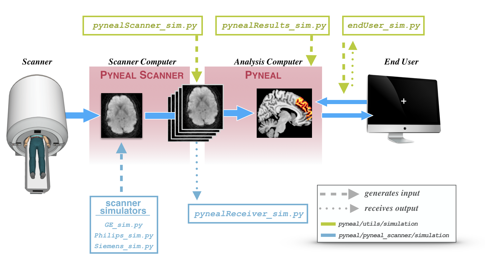
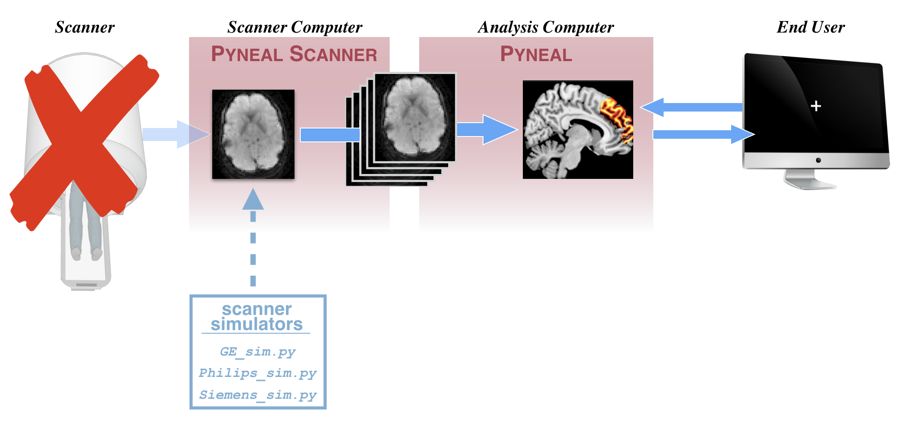
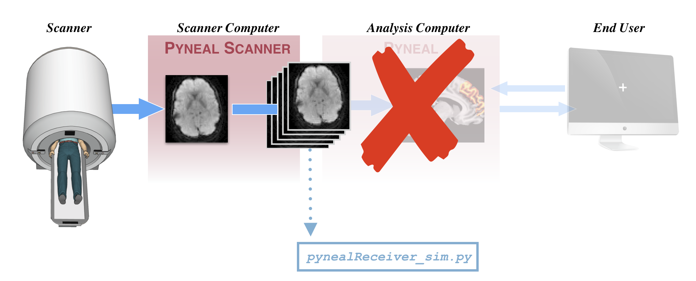

# Simulations

## Overview

In order to help with the initial setup, as well as test any analysis scripts and network communications later on, **Pyneal** includes a suite of simulation tools that mimic various inputs and outputs along the data flow path.

These tools allow you to simulate **Pyneal** (or **Pyneal Scanner**) in a modular fashion without having to run the entire pipeline. If you are troubleshooting issues, these tools are immensely helpful.  

Here is a diagram highlighting the various simulation tools, and where they enter the data flow pipeline. 

During an actual real-time scan, data will flow through this diagram from left to right along the blue arrows. 

Simulation tools are indicated using dashed or dotted vertical lines.

* A dashed line indicates a simulation tool that **generates input**. In other words, these tools mimic real data as it exists at a particular stage of the pipeline

* A dotted line indicates a simulation tool that **receives output**. In other words, these tools allow you to simulate the *next* stage of the pipeline

Both **Pyneal Scanner** and **Pyneal** have their own set of simulation tools. 

* **Pyneal Scanner** simulation tools can be found in `pyneal/pyneal_scanner/simulation` and are shown in light blue *below* the real data pipeline in the schematic. See below for more details

* **Pyneal** simulation tools can be found in `pyneal/utils/simulation` and are shown in green *above* the real data pipeline in the schematic. See below for more details

## Pyneal Scanner Simulation Tools

The **Pyneal Scanner** simulation tools can be found in `pyneal/pyneal_scanner/simulation`

* **Scanner Simulators**: Set of simulation scripts to mimic the behavior of real scanners with real data. 
* **pynealReceiver_sim.py**: simulates the behavior of **Pyneal** (i.e. accepts incoming 3D volumes from **Pyneal Scanner**)

### Scanner Simulators
**Use Case:** Testing **Pyneal Scanner** (and *anything else* downstream) with real data.

This will simulate the appearance of raw data coming off of the scanner. This works by pointing the simulator to a folder containing real scanner data. The simulator will copy the real data to a new directory in a way that mimics the behavior of a real scan, allowing you to test **Pyneal Scanner** and anything else downstream. 

The format of the raw data will vary according to different scanner environments/manufacturers. Accordingly, there are multiple scripts that will simulate different scanner formats:

#### GE

***usage***: `python GE_sim.py inputDir [-o outputDir -t/--TR TR]`

***input args***:  
 
* inputDir: path to directory containing raw slice dicom images. 
* -o outputDir: path to directory where slices will be copied to [default: create new directory named `s9999` in the parent directory of the inputDir]
* -t/--TR TR: set the TR in ms [default: 1000]

GE scanners 

In order to run this script, you must have a local directory that contains raw slice dicom files from an actual scan. If you want to fully mimic the data directory structure of GE scanners, you can create a local directory path that follows the pattern `[baseDir]/p##/e##/s##` where the slice images are stored in a directory named like `s###`, which is nested two levels deep (`p###/e###`) from the `[basedir]`. 

This script will copy all of the slices from the inputDir and copy them to the outputDir at a rate that is set by the TR. 

After the script has completed, the outputDir will be deleted. 

#### Philips

***usage***: `python Philips_sim.py inputDir [--outputDir] [--TR]`

***input args***:
  
* inputDir: path to directory containing raw slice dicom images. 
* -o outputDir: path to directory where slices will be copied to [default: create new directory named `9999` in the parent directory of the inputDir]
* -t/--TR TR: set the TR in ms [default: 1000]

Philips scanners use XTC (eXTernal Control) to output reconstructed volumes to a directory during a scan. The files are written to a designated directory (e.g. XTC_Output), and within that directory, every series is assigned a new directory named sequentially starting with '0000'. For instance, volumes from the 3rd series will be stored like '.../XTC_Output/0002/'. This script will simulate the creation of a new series directory, and copy in PAR/REC files.

You must specify a local path to the inputDir. That is, the directory that already
contains a set of reconstructed PAR/REC files for a series (referred to below as `seriesDir`). 

[OPTIONAL]: You can specify the full path to an output directory where the PAR/REC files
will be copied to. If you don't specify an output directory, this tool will default
to creating a new `seriesDir`, named '9999' saved in the parent directory of the `seriesDir`.

e.g. `python Philips_sim.py /Path/To/My/Existing/Series/0000 --outputDir /Where/I/Want/New/Slice/Data/To/appear`

if you did not specify an outputDir, new PAR/RECs would be copied to:

`/Path/To/My/Existing/Series/9999`

[OPTIONAL]: You can specify the TR at which new PAR/REC data is copied. Default is 1000ms.

e.g. `python GE_sim.py /Path/To/My/Existing/Series/0000 --TR 2000`

#### Siemens

***usage***: `python Siemens_sim.py inputDir seriesNum [--newSeriesNum] [--TR]`

***input args***:
  
* inputDir: path to directory containing raw slice dicom images. 
* seriesNum: series number of data that you want to simulate
* -n/--newSeriesNum: seriesNumber to assign to the new "simulated" data
* -t/--TR TR: set the TR in ms [default: 1000]

Siemens scanners stores reconstructed slices images by taking all of the slices for a single volume, and placing them side-by-side in a larger "mosaic" dicom image. A scan will produce one mosaic image per volume, and all mosaic images for all scans across a single session will be stored in the same directory. This script simulates the creation of that directory, and will pass in real mosaic images.

You must specify a local path to the inputDir as well as the series number of the series you want to simulate.

The input dir should be the directory that already contains a set of reconstructed mosaic images. A single session dir will hold all of the mosaic files for all of the scans for a given session. Mosaic files are named like:

`[session#]_[series#]_[vol#].dcm`

[OPTIONAL]: You can specify the series number that will be assigned to the "new" mosaic images. The default behavior is to assign a series number based on the next sequential number given the existing series. In the example below, the default would be to assign a newSeriesNum as '2', but we are overriding that to assign it as '19'

e.g. `python Siemens_sim.py /Path/To/My/Existing/inputDir 1 --newSeriesNum 19`

[OPTIONAL]: You can specify the TR at which new slice data is copied. Default is 1000ms, and represents the approximate amount of time it should take to copy over all of the slices for one volume of data.

e.g. `python Siemens_sim.py /Path/To/My/Existing/inputDir 1 --TR 2000`

### pynealReceiver_sim.py
**Use Case:** When you want to test **Pyneal Scanner** without having to actually run **Pyneal**

This simulator will mimic the part of **Pyneal** that accepts incoming 3D volumes from **Pyneal Scanner**. This allows you to quickly test sending output with **Pyneal Scanner**, without having to fully run **Pyneal** (which entails a lot of extra overhead). 

usage: `python pynealReceiver_sim.py`

This simulator is hardcoded to be listening for incoming data on port `5556`. Make sure **Pyneal Scanner** is configured to use that same port number for `pynealSocketPort` (see [**Pyneal Scanner Setup**](/setup.md#pyneal-scanner))
 

## Pyneal Simulation Tools