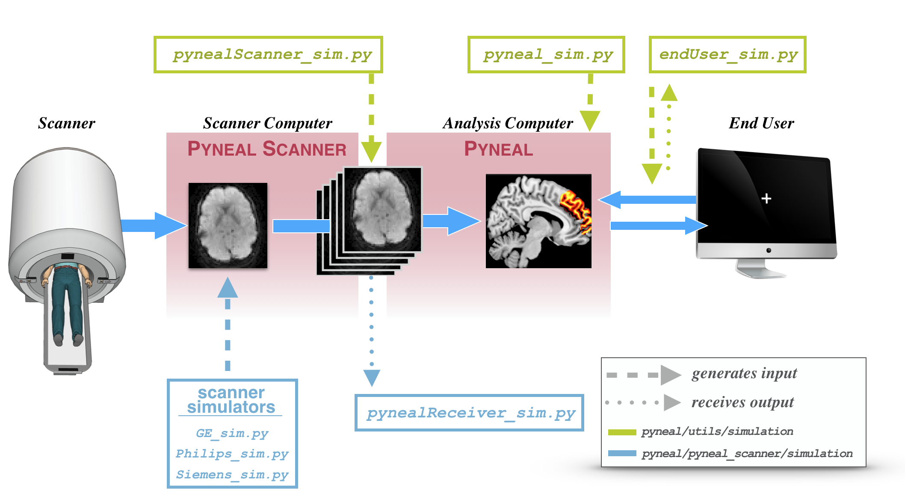

# Simulations

## Overview

In order to help with the initial setup, as well as test any analysis scripts and network communications later on, **Pyneal** includes a suite of simulation tools that mimic various inputs and outputs along the data flow path.

These tools allow you to simulate **Pyneal** (or **Pyneal Scanner**) in a modular fashion without having to run the entire pipeline. If you are troubleshooting issues, these tools are immensely helpful.  

## Pyneal Scanner Simulation Tools

## Pyneal Simulation Tools